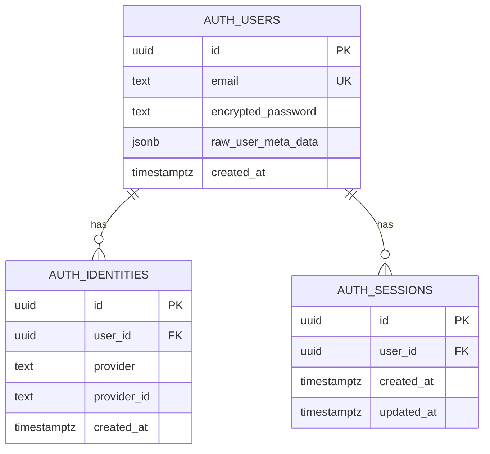

# Data Model: Email/Password Authentication

**Feature**: 004-add-email-add
**Date**: 2025-10-01
**Status**: Complete

## Overview
Email/password authentication uses Supabase Auth's managed tables. No new tables required. This document describes the existing Supabase Auth schema relevant to this feature and how metadata fields will be utilized.

## Entity Definitions

### Auth User (Supabase Managed)
**Table**: `auth.users`
**Purpose**: Core user authentication and identity storage
**Managed By**: Supabase Auth service (do not modify schema)

**Relevant Fields**:
| Field | Type | Constraints | Description |
|-------|------|-------------|-------------|
| id | uuid | PK, NOT NULL | Unique user identifier |
| email | text | UNIQUE, lowercase normalized | User's email address (case-insensitive) |
| encrypted_password | text | nullable | Bcrypt hashed password (null for OAuth-only users) |
| email_confirmed_at | timestamptz | nullable | When email was verified (null = unverified) |
| created_at | timestamptz | NOT NULL, default now() | Account creation timestamp |
| updated_at | timestamptz | NOT NULL, default now() | Last update timestamp |
| last_sign_in_at | timestamptz | nullable | Most recent signin timestamp |
| raw_user_meta_data | jsonb | default '{}' | Custom user metadata (see Metadata Schema below) |
| raw_app_meta_data | jsonb | default '{}' | Application metadata (managed by app) |

**Metadata Schema** (`raw_user_meta_data`):
```json
{
  "failed_login_attempts": 3,
  "lockout_until": "2025-10-01T14:30:00Z",
  "last_failed_attempt": "2025-10-01T14:15:00Z"
}
```

**Field Purposes**:
- `failed_login_attempts` (number): Count of consecutive failed signin attempts
- `lockout_until` (ISO 8601 timestamp): When account lockout expires
- `last_failed_attempt` (ISO 8601 timestamp): Most recent failed attempt time

**Metadata Update Logic**:
- Increment `failed_login_attempts` on each failed signin
- Set `lockout_until` to `now() + 15 minutes` when `failed_login_attempts >= 5`
- Reset all fields to null on successful signin
- Check `lockout_until` before allowing signin attempt

### Auth Identity (Supabase Managed)
**Table**: `auth.identities`
**Purpose**: Track authentication providers for each user
**Managed By**: Supabase Auth service

**Relevant Fields**:
| Field | Type | Constraints | Description |
|-------|------|-------------|-------------|
| id | uuid | PK, NOT NULL | Identity record ID |
| user_id | uuid | FK to auth.users(id) | Associated user |
| provider | text | NOT NULL | Auth provider name |
| provider_id | text | NOT NULL | Provider-specific user ID |
| created_at | timestamptz | NOT NULL | When identity was linked |
| updated_at | timestamptz | NOT NULL | Last update |

**Provider Values**:
- `email`: Email/password authentication
- `google`: Google OAuth
- `azure`: Microsoft OAuth (Azure AD)
- `facebook`: Facebook OAuth

**OAuth Precedence Check Query**:
```sql
SELECT EXISTS (
  SELECT 1 FROM auth.identities
  WHERE user_id = (SELECT id FROM auth.users WHERE LOWER(email) = LOWER($1))
  AND provider IN ('google', 'azure', 'facebook')
) AS has_oauth
```

### Auth Session (Supabase Managed)
**Table**: `auth.sessions`
**Purpose**: Active user sessions
**Managed By**: Supabase Auth service (automatic lifecycle)

**Relevant Fields**:
| Field | Type | Description |
|-------|------|-------------|
| id | uuid | Session ID |
| user_id | uuid | FK to auth.users(id) |
| created_at | timestamptz | Session start time |
| updated_at | timestamptz | Last activity |
| factor_id | uuid | MFA factor (not used in this feature) |
| aal | text | Authentication Assurance Level |

**Session Management**:
- Created automatically by `signInWithPassword()`
- Stored in httpOnly cookie via @supabase/ssr
- Auto-refreshed by Supabase client
- Matches OAuth session duration (FR-011 requirement)

## Entity Relationships



**Relationship Rules**:
1. One user can have multiple identities (email + multiple OAuth providers)
2. One user can have multiple active sessions (different devices/browsers)
3. Identities are immutable once created (cannot change provider)
4. Sessions expire based on Supabase Auth configuration (matches OAuth)

## Data Lifecycle

### User Creation (Admin-Only)
**Method**: Supabase Console or Admin API
**Flow**:
1. Admin navigates to Supabase Dashboard → Authentication → Users
2. Click "Add user" → "Create new user"
3. Enter email and password
4. User record created in `auth.users`
5. Identity record created in `auth.identities` with provider='email'
6. `raw_user_meta_data` initialized to empty object

**Constraints**:
- Email must be unique across all users
- Password is automatically bcrypt hashed
- Email confirmation can be bypassed for admin-created users
- User cannot self-register (blocked by auth hook)

### Email/Password Signin
**Method**: `signInWithPassword()` API call
**Flow**:
1. Check `lockout_until` in metadata → reject if locked out
2. Check OAuth precedence via `auth.identities` → reject if OAuth exists
3. Verify email exists in `auth.users`
4. Verify password matches `encrypted_password` (bcrypt compare)
5. On success: Create session in `auth.sessions`, reset metadata counters
6. On failure: Increment `failed_login_attempts`, set lockout if >= 5

**State Transitions**:
```
Normal → Failed (1-4) → Locked Out (15-30 min) → Normal (after timeout)
     ↓                                            ↑
  Success (reset) ──────────────────────────────┘
```

### Session Refresh
**Method**: Automatic via Supabase client
**Flow**:
1. Client detects token expiration approaching
2. Calls `refreshSession()` with refresh token
3. New access token issued
4. Session `updated_at` timestamp refreshed
5. Cookie updated with new tokens

### Signout
**Method**: `signOut()` API call
**Flow**:
1. Session deleted from `auth.sessions`
2. Cookies cleared
3. Metadata counters NOT reset (lockout persists)

## Validation Rules

### Email Validation
- **Format**: RFC 5322 compliant (validated by Zod schema)
- **Normalization**: Lowercased before storage/comparison
- **Uniqueness**: Enforced at database level (unique constraint)
- **Max Length**: 255 characters (Supabase limit)

**Zod Schema**:
```typescript
z.string()
  .email("Invalid email format")
  .max(255, "Email too long")
  .transform(val => val.toLowerCase().trim())
```

### Password Validation
- **No minimum length**: Per requirements (admin responsibility)
- **No complexity requirements**: Per requirements
- **Storage**: Bcrypt hashed automatically by Supabase
- **Never returned**: Password hash never exposed in API responses

### Metadata Validation
- **failed_login_attempts**: Non-negative integer, max 999
- **lockout_until**: Valid ISO 8601 timestamp or null
- **last_failed_attempt**: Valid ISO 8601 timestamp or null

**Update Constraints**:
- Only API route can modify lockout metadata
- Client cannot directly update `raw_user_meta_data`
- Metadata updates use Supabase Admin API (server-side only)

## Indexes & Performance

### Existing Indexes (Supabase Managed)
- `auth.users.email` → Unique B-tree index (fast lookup)
- `auth.identities.user_id` → B-tree index (FK queries)
- `auth.identities.provider` → B-tree index (provider filtering)
- `auth.sessions.user_id` → B-tree index (session queries)

### Query Performance
- Email lookup: O(log n) via index
- OAuth check: O(log n) via composite filter
- Metadata JSON access: O(1) field extraction

**No new indexes required** - existing Supabase indexes are sufficient.

## Security Considerations

### Row Level Security (RLS)
**Not applicable** - `auth.*` tables are managed by Supabase Auth service, not exposed via PostgREST. Access only via Supabase Auth API.

### Data Protection
- **Password hashing**: Bcrypt with salt (Supabase default)
- **Email privacy**: Never expose full email list via API
- **Metadata privacy**: Only accessible to user's own session or admin API
- **Session security**: httpOnly cookies prevent XSS theft

### Audit Trail
- `created_at`: Track account creation time
- `last_sign_in_at`: Monitor signin activity
- `updated_at`: Detect suspicious account changes
- Consider: Separate audit log for failed signin attempts (future enhancement)

## Migration Plan

**No database migrations required** - Feature uses existing Supabase Auth tables.

**Configuration Changes**:
1. Deploy auth hook to block signups (Postgres function or HTTP endpoint)
2. Enable email/password provider in Supabase Dashboard (default: enabled)
3. Configure email confirmation settings (optional: disable for admin-created users)

**Data Seeding**:
- Create test user via Supabase Console for development
- Production users created by admin on-demand
- No bulk import required

## Data Retention

### Active Users
- Retained indefinitely while account is active
- Sessions expire per Supabase Auth config (matches OAuth duration)
- Metadata persists until reset by successful signin

### Deleted Users
- Soft delete: `deleted_at` timestamp set
- Hard delete: Full record removal (admin action)
- Cascades to identities and sessions automatically

**Lockout Expiry**:
- Automatically expires after 15-30 minutes
- No cleanup job required (check `lockout_until` on each signin)

---

**Data Model Status**: ✅ Complete
**No schema changes required** - uses existing Supabase Auth tables
**Next**: API Contracts (contracts/auth-endpoints.md)
